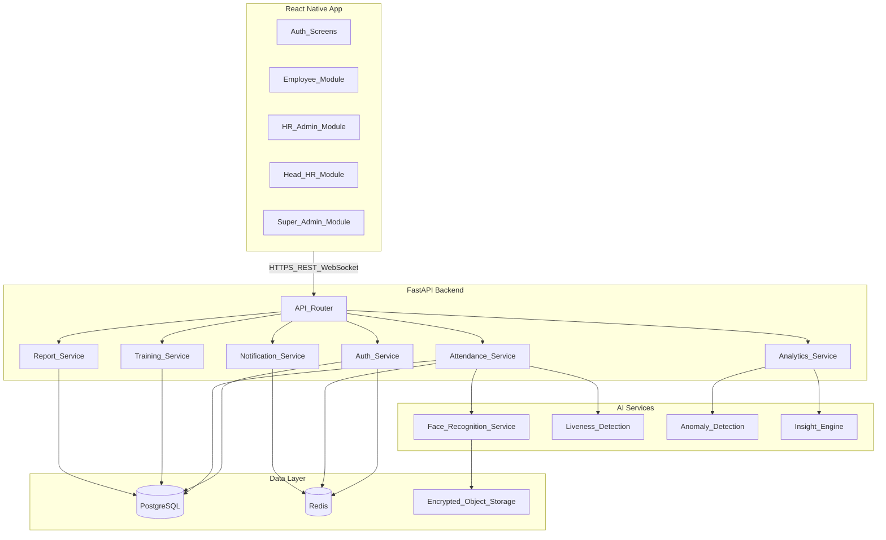

# System Architecture

## Overview

Single React Native client for all user roles, backed by a FastAPI monolith (modular services) with PostgreSQL, Redis, and an AI inference layer for face recognition and workforce analytics.



## Multi-Tenancy

- Every business table includes `organization_id`
- JWT claims carry `org_id` and `roles`
- Middleware enforces tenant isolation on all queries
- Super Admin can switch org context via header `X-Org-Id`

## Communication Patterns

| Pattern | Use Case |
|---------|----------|
| REST (JSON) | CRUD, check-in/out, reports |
| WebSocket | Live attendance map, real-time feedback dashboard |
| Redis Pub/Sub | Internal event bus (attendance marked, feedback submitted) |
| Push (FCM/APNs) | Reminders and alerts |
| Background jobs (Celery/ARQ) | Report generation, nightly analytics, notification batching |

## Service Boundaries

### Auth Service
Login, MFA, token refresh, password reset, session management.

### Attendance Service
Check-in/out, geofence validation, status classification, working hours, corrections.

### Training Service
Training CRUD, session scheduling, participant assignment, training attendance (face/QR/geo).

### Report Service
Async report generation (Excel/PDF/CSV), file storage, signed download URLs.

### Notification Service
Push token registration, scheduled reminders, alert dispatch.

### Analytics Service
Risk scores, trend aggregation, recommendation engine, executive KPIs.

### Face Service (AI)
Enrollment embedding extraction, verification, liveness scoring.

## Scalability Targets

| Scale | Approach |
|-------|----------|
| 100–1K employees | Single API instance, single Redis, managed PostgreSQL |
| 1K–10K | Horizontal API replicas, Redis cluster, read replicas |
| 10K–100K+ | Org-sharded analytics jobs, CDN for reports, dedicated face inference workers |

## Security Architecture

- TLS everywhere (API, object storage)
- JWT access tokens (short-lived) + refresh tokens (Redis-backed)
- Face embeddings encrypted at rest (AES-256)
- Raw face images deleted after embedding extraction (configurable retention)
- Audit log for all admin actions and biometric events

## Deployment Topology

```
[Mobile App] → [Load Balancer] → [FastAPI Pods]
                                      ↓
                    [PostgreSQL] [Redis] [S3/Blob] [Face Worker]
                                      ↓
                              [FCM / APNs]
```

See [DEPLOYMENT.md](DEPLOYMENT.md) for environment-specific configuration.
