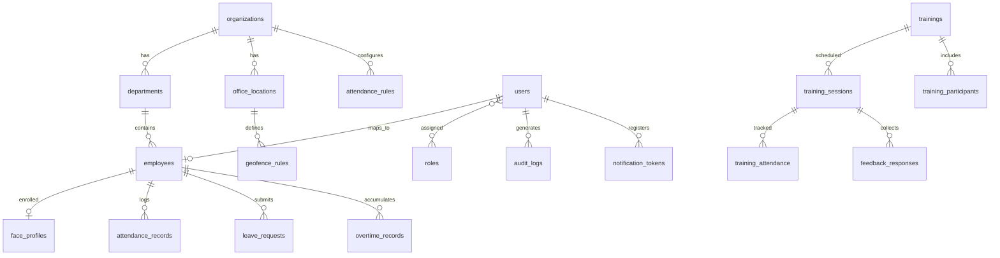

# Database Schema

PostgreSQL 16. All tables include `organization_id` for multi-tenancy unless platform-global.

## Entity Relationship

---

## Core Tables

### organizations

| Column | Type | Constraints |
|--------|------|-------------|
| id | UUID | PK, default gen_random_uuid() |
| name | VARCHAR(255) | NOT NULL |
| slug | VARCHAR(100) | UNIQUE, NOT NULL |
| timezone | VARCHAR(50) | DEFAULT 'Asia/Kolkata' |
| is_active | BOOLEAN | DEFAULT true |
| created_at | TIMESTAMPTZ | DEFAULT now() |
| updated_at | TIMESTAMPTZ | DEFAULT now() |

### departments

| Column | Type | Constraints |
|--------|------|-------------|
| id | UUID | PK |
| organization_id | UUID | FK → organizations, NOT NULL |
| name | VARCHAR(255) | NOT NULL |
| code | VARCHAR(50) | |
| head_employee_id | UUID | FK → employees, nullable |
| created_at | TIMESTAMPTZ | DEFAULT now() |
| updated_at | TIMESTAMPTZ | DEFAULT now() |

**Index:** `(organization_id)`, `(organization_id, code)`

### users

| Column | Type | Constraints |
|--------|------|-------------|
| id | UUID | PK |
| organization_id | UUID | FK → organizations, NOT NULL |
| email | VARCHAR(255) | NOT NULL |
| password_hash | VARCHAR(255) | NOT NULL |
| is_active | BOOLEAN | DEFAULT true |
| mfa_secret | VARCHAR(255) | nullable |
| mfa_enabled | BOOLEAN | DEFAULT false |
| last_login_at | TIMESTAMPTZ | |
| created_at | TIMESTAMPTZ | DEFAULT now() |
| updated_at | TIMESTAMPTZ | DEFAULT now() |

**Unique:** `(organization_id, email)`

### roles

| Column | Type | Constraints |
|--------|------|-------------|
| id | UUID | PK |
| name | VARCHAR(50) | UNIQUE — employee, hr_manager, head_hr, super_admin |
| description | TEXT | |

### user_roles

| Column | Type | Constraints |
|--------|------|-------------|
| user_id | UUID | FK → users |
| role_id | UUID | FK → roles |
| organization_id | UUID | FK → organizations |

**PK:** `(user_id, role_id, organization_id)`

### employees

| Column | Type | Constraints |
|--------|------|-------------|
| id | UUID | PK |
| organization_id | UUID | FK, NOT NULL |
| user_id | UUID | FK → users, UNIQUE |
| department_id | UUID | FK → departments |
| employee_code | VARCHAR(50) | NOT NULL |
| full_name | VARCHAR(255) | NOT NULL |
| designation | VARCHAR(255) | |
| mobile | VARCHAR(20) | |
| is_active | BOOLEAN | DEFAULT true |
| face_enrolled | BOOLEAN | DEFAULT false |
| created_at | TIMESTAMPTZ | DEFAULT now() |
| updated_at | TIMESTAMPTZ | DEFAULT now() |

**Unique:** `(organization_id, employee_code)`

---

## Attendance Tables

### office_locations

| Column | Type | Constraints |
|--------|------|-------------|
| id | UUID | PK |
| organization_id | UUID | FK, NOT NULL |
| name | VARCHAR(255) | NOT NULL |
| latitude | DECIMAL(10,7) | NOT NULL |
| longitude | DECIMAL(10,7) | NOT NULL |
| radius_meters | INT | DEFAULT 300 |
| is_active | BOOLEAN | DEFAULT true |
| created_at | TIMESTAMPTZ | DEFAULT now() |

### attendance_rules

| Column | Type | Constraints |
|--------|------|-------------|
| id | UUID | PK |
| organization_id | UUID | FK, NOT NULL |
| work_start_time | TIME | NOT NULL — e.g. 09:00 |
| work_end_time | TIME | NOT NULL — e.g. 18:00 |
| late_threshold_minutes | INT | DEFAULT 15 |
| half_day_threshold_hours | DECIMAL(4,2) | DEFAULT 4.0 |
| standard_hours | DECIMAL(4,2) | DEFAULT 8.0 |
| working_days | JSONB | e.g. [1,2,3,4,5] (Mon–Fri) |
| created_at | TIMESTAMPTZ | DEFAULT now() |
| updated_at | TIMESTAMPTZ | DEFAULT now() |

### face_profiles

| Column | Type | Constraints |
|--------|------|-------------|
| id | UUID | PK |
| employee_id | UUID | FK → employees, UNIQUE |
| organization_id | UUID | FK, NOT NULL |
| embedding_front | BYTEA | encrypted |
| embedding_left | BYTEA | encrypted |
| embedding_right | BYTEA | encrypted |
| embedding_up | BYTEA | encrypted |
| embedding_down | BYTEA | encrypted |
| enrolled_at | TIMESTAMPTZ | DEFAULT now() |
| version | INT | DEFAULT 1 |

### attendance_records

| Column | Type | Constraints |
|--------|------|-------------|
| id | UUID | PK |
| organization_id | UUID | FK, NOT NULL |
| employee_id | UUID | FK, NOT NULL |
| date | DATE | NOT NULL |
| check_in_at | TIMESTAMPTZ | |
| check_out_at | TIMESTAMPTZ | |
| check_in_lat | DECIMAL(10,7) | |
| check_in_lng | DECIMAL(10,7) | |
| check_out_lat | DECIMAL(10,7) | |
| check_out_lng | DECIMAL(10,7) | |
| office_location_id | UUID | FK |
| status | VARCHAR(20) | present, late, half_day, absent, holiday, leave |
| working_minutes | INT | computed |
| face_verified | BOOLEAN | |
| geo_verified | BOOLEAN | |
| device_info | JSONB | |
| created_at | TIMESTAMPTZ | DEFAULT now() |
| updated_at | TIMESTAMPTZ | DEFAULT now() |

**Unique:** `(employee_id, date)`
**Index:** `(organization_id, date)`, `(employee_id, date DESC)`

### attendance_corrections

| Column | Type | Constraints |
|--------|------|-------------|
| id | UUID | PK |
| attendance_record_id | UUID | FK |
| requested_by | UUID | FK → users |
| reason | TEXT | NOT NULL |
| proposed_check_in | TIMESTAMPTZ | |
| proposed_check_out | TIMESTAMPTZ | |
| status | VARCHAR(20) | pending, approved, rejected |
| reviewed_by | UUID | FK → users |
| reviewed_at | TIMESTAMPTZ | |
| created_at | TIMESTAMPTZ | DEFAULT now() |

### leave_requests

| Column | Type | Constraints |
|--------|------|-------------|
| id | UUID | PK |
| organization_id | UUID | FK |
| employee_id | UUID | FK |
| leave_type | VARCHAR(50) | casual, sick, earned, etc. |
| start_date | DATE | NOT NULL |
| end_date | DATE | NOT NULL |
| reason | TEXT | |
| status | VARCHAR(20) | pending, approved, rejected |
| approved_by | UUID | FK → users |
| created_at | TIMESTAMPTZ | DEFAULT now() |

### overtime_records

| Column | Type | Constraints |
|--------|------|-------------|
| id | UUID | PK |
| organization_id | UUID | FK |
| employee_id | UUID | FK |
| date | DATE | NOT NULL |
| worked_minutes | INT | NOT NULL |
| standard_minutes | INT | NOT NULL |
| overtime_minutes | INT | NOT NULL |
| created_at | TIMESTAMPTZ | DEFAULT now() |

**Unique:** `(employee_id, date)`

---

## Training Tables

### trainings

| Column | Type | Constraints |
|--------|------|-------------|
| id | UUID | PK |
| organization_id | UUID | FK |
| title | VARCHAR(255) | NOT NULL |
| description | TEXT | |
| trainer_name | VARCHAR(255) | |
| materials_url | VARCHAR(500) | |
| created_by | UUID | FK → users |
| created_at | TIMESTAMPTZ | DEFAULT now() |

### training_sessions

| Column | Type | Constraints |
|--------|------|-------------|
| id | UUID | PK |
| training_id | UUID | FK |
| organization_id | UUID | FK |
| scheduled_at | TIMESTAMPTZ | NOT NULL |
| duration_minutes | INT | |
| location_lat | DECIMAL(10,7) | nullable |
| location_lng | DECIMAL(10,7) | nullable |
| qr_token | VARCHAR(255) | unique, time-limited |
| qr_expires_at | TIMESTAMPTZ | |
| status | VARCHAR(20) | scheduled, active, completed, cancelled |

### training_participants

| Column | Type | Constraints |
|--------|------|-------------|
| training_id | UUID | FK |
| employee_id | UUID | FK |
| organization_id | UUID | FK |

**PK:** `(training_id, employee_id)`

### training_attendance

| Column | Type | Constraints |
|--------|------|-------------|
| id | UUID | PK |
| session_id | UUID | FK → training_sessions |
| employee_id | UUID | FK |
| method | VARCHAR(20) | face, qr, geo |
| checked_in_at | TIMESTAMPTZ | DEFAULT now() |
| geo_verified | BOOLEAN | |

**Unique:** `(session_id, employee_id)`

### feedback_responses

| Column | Type | Constraints |
|--------|------|-------------|
| id | UUID | PK |
| session_id | UUID | FK |
| employee_id | UUID | FK |
| trainer_rating | SMALLINT | 1–5 |
| content_rating | SMALLINT | 1–5 |
| practical_rating | SMALLINT | 1–5 |
| suggestions | TEXT | |
| submitted_at | TIMESTAMPTZ | DEFAULT now() |

**Unique:** `(session_id, employee_id)`

---

## Analytics & System Tables

### employee_risk_scores

| Column | Type | Constraints |
|--------|------|-------------|
| id | UUID | PK |
| employee_id | UUID | FK |
| organization_id | UUID | FK |
| absenteeism_score | DECIMAL(5,2) | 0–100 |
| lateness_score | DECIMAL(5,2) | |
| engagement_score | DECIMAL(5,2) | |
| overall_risk | DECIMAL(5,2) | |
| computed_at | TIMESTAMPTZ | DEFAULT now() |

### ai_recommendations

| Column | Type | Constraints |
|--------|------|-------------|
| id | UUID | PK |
| organization_id | UUID | FK |
| type | VARCHAR(50) | training_needed, absenteeism_risk, dept_low_attendance |
| target_type | VARCHAR(20) | employee, department |
| target_id | UUID | |
| message | TEXT | |
| priority | VARCHAR(10) | low, medium, high |
| created_at | TIMESTAMPTZ | DEFAULT now() |
| dismissed_at | TIMESTAMPTZ | |

### audit_logs

| Column | Type | Constraints |
|--------|------|-------------|
| id | UUID | PK |
| organization_id | UUID | FK |
| user_id | UUID | FK |
| action | VARCHAR(100) | NOT NULL |
| resource_type | VARCHAR(50) | |
| resource_id | UUID | |
| metadata | JSONB | |
| ip_address | INET | |
| created_at | TIMESTAMPTZ | DEFAULT now() |

**Index:** `(organization_id, created_at DESC)`

### notification_tokens

| Column | Type | Constraints |
|--------|------|-------------|
| id | UUID | PK |
| user_id | UUID | FK |
| token | VARCHAR(500) | NOT NULL |
| platform | VARCHAR(10) | android, ios |
| created_at | TIMESTAMPTZ | DEFAULT now() |

### holidays

| Column | Type | Constraints |
|--------|------|-------------|
| id | UUID | PK |
| organization_id | UUID | FK |
| date | DATE | NOT NULL |
| name | VARCHAR(255) | |
| created_at | TIMESTAMPTZ | DEFAULT now() |

**Unique:** `(organization_id, date)`

---

## Migration Strategy

- Use Alembic for all schema changes
- One migration per logical change
- Never edit applied migrations
- Seed roles and default attendance rules on first deploy
