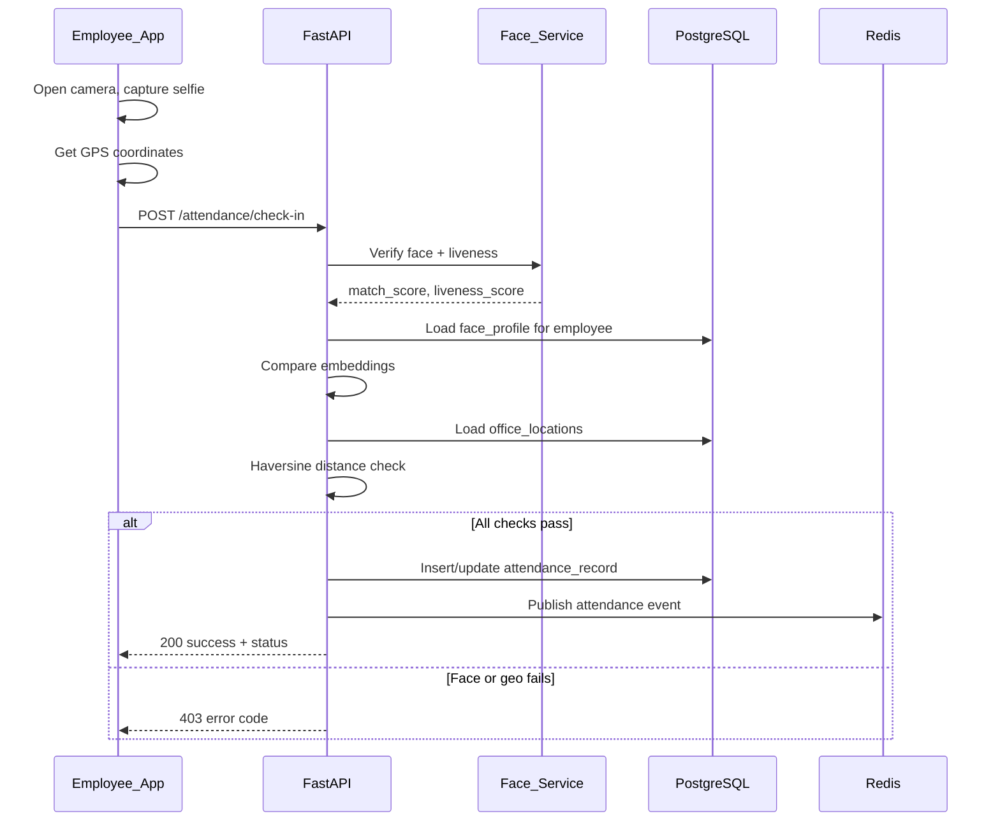
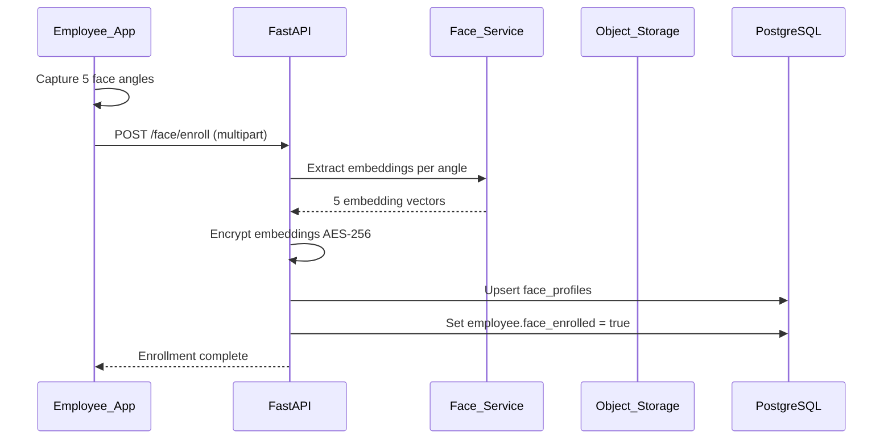
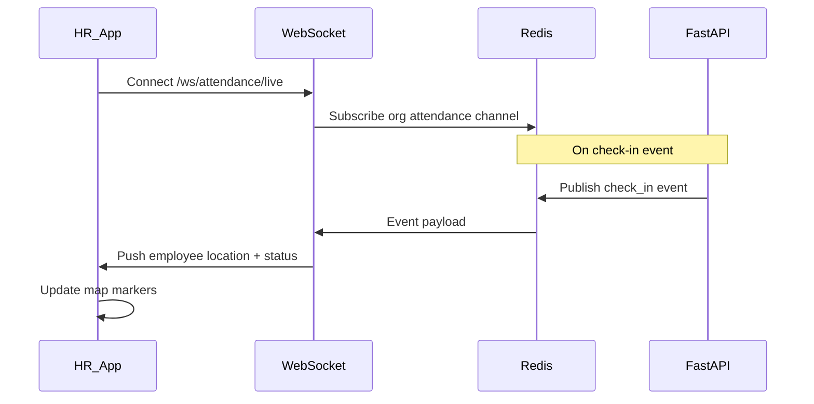
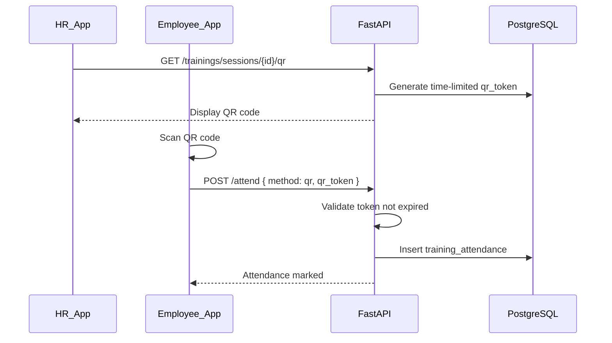
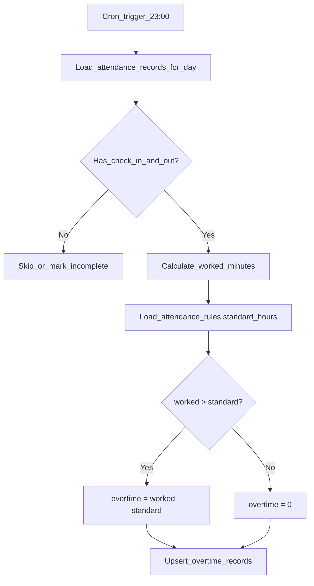
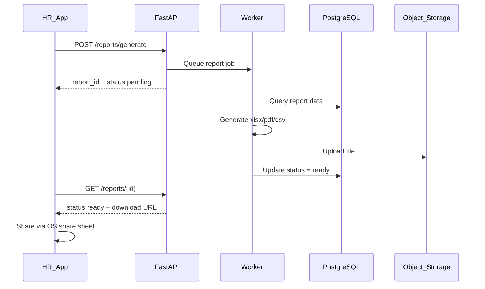
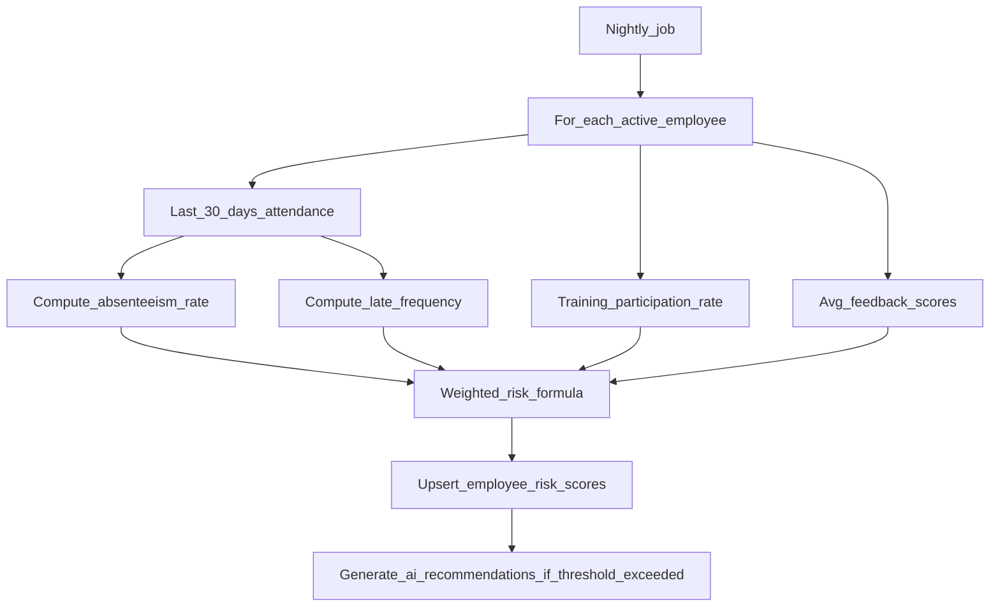
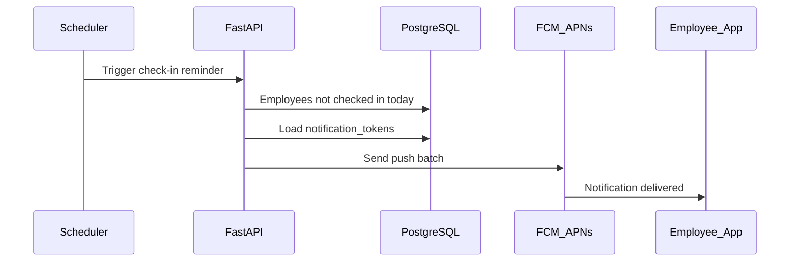
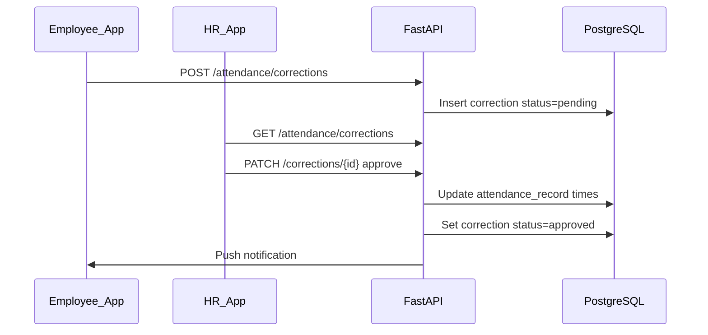

# Data Flows

## 1. Employee Check-In Flow

## 2. Face Enrollment Flow

## 3. HR Live Attendance Map

## 4. Training QR Attendance

## 5. Overtime Computation (Nightly Job)

## 6. Report Generation

## 7. AI Risk Score Computation

## 8. Push Notification Flow

## 9. Attendance Correction Approval

## 10. Multi-Tenant Request Isolation

Every authenticated request:

1. Extract `org_id` from JWT
2. Apply `WHERE organization_id = :org_id` on all queries
3. Super Admin may override via `X-Org-Id` header
4. Reject cross-tenant resource access with 404
