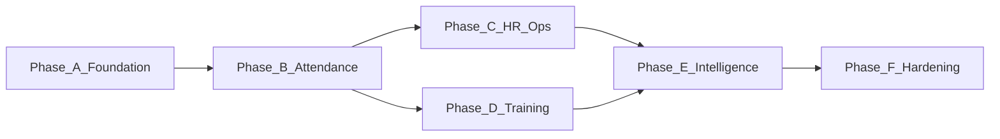

# Implementation Roadmap

Full V1.0 delivery in six phases. Each phase produces testable, deployable increments.

## Phase A — Foundation (Weeks 1–3)

**Goal:** Runnable monorepo with auth, multi-tenant org structure, role-based navigation shell.

### Backend
- [ ] FastAPI project scaffold with Alembic
- [ ] PostgreSQL schema: organizations, departments, users, employees, roles
- [ ] JWT auth + refresh tokens (Redis)
- [ ] RBAC middleware
- [ ] Audit log table and decorator
- [ ] Health check, OpenAPI docs

### Mobile
- [ ] React Native scaffold (TypeScript)
- [ ] Login / logout screens
- [ ] Role-based RootNavigator
- [ ] API client with token refresh
- [ ] Placeholder screens per role

### Infrastructure
- [ ] docker-compose: PostgreSQL, Redis, backend
- [ ] GitHub Actions: lint + test on PR

**Exit criteria:** User can log in, see role-appropriate empty screens, CRUD org/dept/employee via API.

---

## Phase B — Core Attendance (Weeks 4–7)

**Goal:** Face enrollment, liveness, geofencing, check-in/out with status classification.

### Backend + AI
- [ ] Face enrollment API (5 angles → encrypted embeddings)
- [ ] Liveness detection integration
- [ ] Face verification on check-in/out
- [ ] Office location + geofence config APIs
- [ ] Haversine distance validation (300m)
- [ ] Attendance record creation
- [ ] Status classifier (present, late, half-day, absent)
- [ ] Working hours calculation

### Mobile
- [ ] Face enrollment wizard (employee onboarding)
- [ ] Check-in / check-out flow with camera + GPS
- [ ] Attendance history screen
- [ ] Super Admin: geofence config screen

**Exit criteria:** Employee can enroll face, check in within geofence, view history. Out-of-range or failed face → rejected.

---

## Phase C — HR Operations (Weeks 8–10)

**Goal:** Leave, overtime, corrections, notifications, HR dashboard.

### Backend
- [ ] Leave request + approval workflow
- [ ] Attendance correction request + HR approval
- [ ] Overtime calculation job (daily)
- [ ] Push notification service (FCM/APNs)
- [ ] Scheduled reminders (check-in/out)
- [ ] WebSocket: live attendance feed
- [ ] HR dashboard aggregation APIs

### Mobile
- [ ] Leave apply / status screens (employee)
- [ ] HR: attendance dashboard widgets
- [ ] HR: live map (react-native-maps)
- [ ] HR: correction approval screen
- [ ] OT summary screen (HR)

**Exit criteria:** Full daily attendance lifecycle with HR visibility and push reminders.

---

## Phase D — Training & Feedback (Weeks 11–13)

**Goal:** Training management, multi-method attendance, feedback collection.

### Backend
- [ ] Training + session CRUD
- [ ] Participant assignment
- [ ] Training attendance: face, QR, geo endpoints
- [ ] QR token generation (time-limited)
- [ ] Feedback form submission + aggregation
- [ ] Training metrics APIs

### Mobile
- [ ] HR: create/manage training screens
- [ ] Employee: training list, join session
- [ ] QR scanner for training check-in
- [ ] Post-training feedback form
- [ ] HR: training dashboard
- [ ] Head HR: feedback live feed

**Exit criteria:** End-to-end training session with attendance tracking and feedback.

---

## Phase E — Intelligence & Reports (Weeks 14–16)

**Goal:** AI insights, risk scoring, report export, Head HR executive dashboard.

### Backend + AI
- [ ] Attendance anomaly detection (late patterns, absenteeism)
- [ ] Employee risk score computation (nightly job)
- [ ] Top performer ranking
- [ ] Recommendation engine (rule-based V1, ML-ready)
- [ ] Report generation: attendance, OT, training (Excel/PDF/CSV)
- [ ] Signed download URLs

### Mobile
- [ ] Head HR: executive KPI dashboard
- [ ] Head HR: AI insights and recommendations screens
- [ ] HR/Head HR: report request + download/share
- [ ] Charts for trends (gifted-charts)

**Exit criteria:** Head HR sees AI-driven insights; all report types exportable from app.

---

## Phase F — Hardening (Weeks 17–18)

**Goal:** Production readiness, compliance, performance.

- [ ] MFA (TOTP) for admin roles
- [ ] Rate limiting (Redis)
- [ ] DPDP/GDPR: consent flows, data export, erasure endpoints
- [ ] Face data retention policy enforcement
- [ ] Load testing (10K concurrent check-ins simulation)
- [ ] Security audit checklist
- [ ] App store build pipelines (Android + iOS)
- [ ] Production deployment runbook

**Exit criteria:** Security review passed, load test targets met, app store-ready builds.

---

## Dependency Graph

## Risk Buffer

Add 20% time buffer for face AI tuning and app store review cycles.
