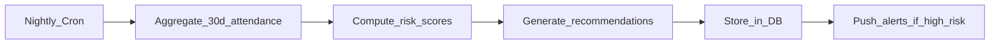

# AI Analytics Module

## Overview

AI-powered workforce intelligence: attendance insights, risk scoring, top performers, and actionable recommendations for Head HR.

## Components

| Component | V1 Approach | Future |
|-----------|-------------|--------|
| Attendance insights | Statistical analysis | ML time-series |
| Risk scoring | Weighted formula | Predictive ML model |
| Top performers | Composite ranking | ML ranking |
| Recommendations | Rule-based engine | LLM-powered |

## Attendance Insights

### Detected Patterns

| Insight | Detection Logic |
|---------|-----------------|
| Frequent late arrivals | > 3 late days in rolling 14 days |
| High absenteeism | > 10% absent rate in rolling 30 days |
| Attendance trend | Week-over-week change > 15% |
| Department anomaly | Dept absent rate > org avg + 2σ |

### API

`GET /analytics/insights`

```json
{
  "insights": [
    {
      "type": "frequent_late",
      "employee_id": "uuid",
      "employee_name": "John Doe",
      "severity": "medium",
      "detail": "Late 5 of last 10 working days"
    }
  ]
}
```

## Employee Risk Scores

Computed nightly, stored in `employee_risk_scores`.

### Formula (V1)

```
absenteeism_score = min(100, absent_days_30d / working_days_30d × 100)
lateness_score = min(100, late_days_30d / working_days_30d × 100)
engagement_score = 100 - (
  training_participation_rate × 30 +
  avg_feedback_score_normalized × 30 +
  attendance_rate × 40
) / 100 × 100

overall_risk = (
  absenteeism_score × 0.4 +
  lateness_score × 0.3 +
  engagement_score × 0.3
)
```

| Score Range | Risk Level |
|-------------|------------|
| 0–30 | Low |
| 31–60 | Medium |
| 61–100 | High |

## Top Performers

Composite score per employee (rolling 90 days):

```
performance_score = (
  attendance_rate × 0.4 +
  training_completion_rate × 0.3 +
  avg_feedback_given × 0.1 +  # participation
  punctuality_rate × 0.2
) × 100
```

`GET /analytics/top-performers?limit=10`

## Recommendation Engine

Rule-based V1 rules:

| Rule | Condition | Recommendation |
|------|-----------|----------------|
| `training_needed` | Training completion < 50% | "Enroll in upcoming sessions" |
| `absenteeism_risk` | `overall_risk > 60` | "Schedule 1:1 with employee" |
| `dept_low_attendance` | Dept rate < org avg − 10% | "Review department scheduling" |
| `low_engagement` | No training in 60 days | "Assign refresher training" |

Stored in `ai_recommendations` table. Head HR can dismiss.

### API

`GET /analytics/recommendations`

```json
{
  "recommendations": [
    {
      "id": "uuid",
      "type": "absenteeism_risk",
      "target_type": "employee",
      "target_id": "uuid",
      "message": "John Doe has high absenteeism risk (score: 72). Consider intervention.",
      "priority": "high"
    }
  ]
}
```

## Executive KPIs

`GET /analytics/executive`

```json
{
  "attendance_rate": 94.5,
  "productivity_score": 87.2,
  "engagement_score": 78.0,
  "training_effectiveness": 4.3,
  "departments": [
    {
      "id": "uuid",
      "name": "Engineering",
      "attendance_rate": 96.1,
      "training_completion": 82.0
    }
  ]
}
```

## Mobile Screens (Head HR)

| Screen | Content |
|--------|---------|
| `ExecutiveDashboardScreen` | KPI cards |
| `AIInsightsScreen` | Insight list with severity badges |
| `RecommendationsScreen` | Actionable cards, dismiss |
| `TopPerformersScreen` | Ranked leaderboard |
| `DepartmentPerformanceScreen` | Comparison charts |

## Data Pipeline



## Future ML Enhancements (Post-V1)

- Attrition prediction model
- Skill gap analysis from training data
- LLM chatbot for HR queries
- AI productivity score (single composite metric)
