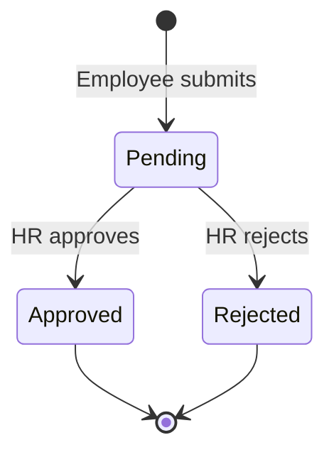

# Leave Module

## Overview

Employees apply for leave; HR Manager approves or rejects. Approved leave auto-sets attendance status to `leave` for covered dates.

## Leave Types

| Type | Code | Description |
|------|------|-------------|
| Casual Leave | `casual` | Short personal leave |
| Sick Leave | `sick` | Medical leave |
| Earned Leave | `earned` | Accrued annual leave |
| Unpaid Leave | `unpaid` | Without pay |

Leave balance tracking — optional V2 enhancement.

## Workflow

## Request Fields

| Field | Required | Description |
|-------|----------|-------------|
| `leave_type` | Yes | Type code |
| `start_date` | Yes | First day of leave |
| `end_date` | Yes | Last day of leave |
| `reason` | Yes | Text explanation |

## Validation Rules

- `start_date` ≤ `end_date`
- Cannot apply for past dates (except today with HR override)
- Overlapping approved leave → reject with `LEAVE_OVERLAP`
- Max consecutive days — configurable per org (V2)

## On Approval

1. Update `leave_requests.status = approved`
2. For each date in range:
   - Upsert `attendance_records` with `status = leave`
3. Notify employee via push
4. Log in `audit_logs`

## API

| Method | Endpoint | Role |
|--------|----------|------|
| POST | `/leave` | Employee |
| GET | `/leave` | Employee (own) / HR (all) |
| PATCH | `/leave/{id}` | HR Manager |

## Mobile Screens

| Screen | Role | Description |
|--------|------|-------------|
| `LeaveScreen` | Employee | Apply + view status |
| `LeaveApprovalScreen` | HR | Pending queue |

## Attendance Integration

Nightly `mark_absent` job skips dates with approved leave.

## Future (V2)

- Leave balance per type
- Half-day leave (first/second half)
- Multi-level approval (manager → HR)
