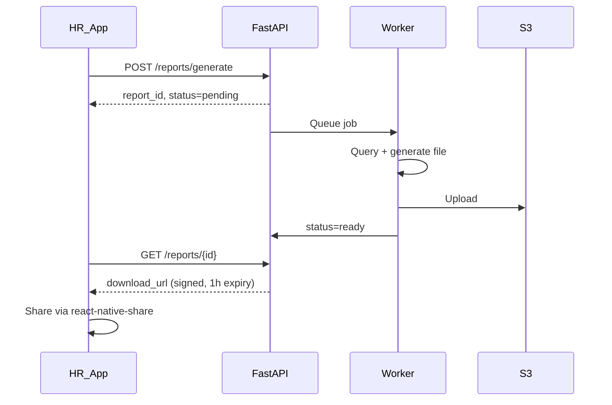

# Reports Module

## Overview

Async report generation for attendance, overtime, and training data. Export formats: Excel, PDF, CSV. Download via signed URL and OS share sheet.

## Report Types

| Type | Code | Content |
|------|------|---------|
| Attendance | `attendance` | Daily records, status, working hours |
| Overtime | `overtime` | OT minutes by employee/department |
| Training | `training` | Session attendance, completion, feedback |

## Formats

| Format | Library | Extension |
|--------|---------|-----------|
| Excel | openpyxl | `.xlsx` |
| PDF | reportlab | `.pdf` |
| CSV | pandas | `.csv` |

## Request Flow



## API

### POST `/reports/generate`

```json
{
  "type": "attendance",
  "format": "xlsx",
  "start_date": "2026-06-01",
  "end_date": "2026-06-30",
  "department_id": "optional-uuid",
  "employee_id": "optional-uuid"
}
```

**Response:**
```json
{
  "report_id": "uuid",
  "status": "pending",
  "estimated_seconds": 30
}
```

### GET `/reports/{id}`

```json
{
  "report_id": "uuid",
  "status": "ready",
  "type": "attendance",
  "format": "xlsx",
  "download_url": "https://s3.../signed",
  "expires_at": "2026-06-18T12:00:00Z",
  "file_size_bytes": 245000
}
```

## Report Columns

### Attendance Report

| Column | Description |
|--------|-------------|
| Employee Code | |
| Employee Name | |
| Department | |
| Date | |
| Check-In | Time |
| Check-Out | Time |
| Working Hours | Formatted |
| Status | present/late/etc. |
| Face Verified | Yes/No |
| Geo Verified | Yes/No |

### Overtime Report

| Column | Description |
|--------|-------------|
| Employee Code | |
| Employee Name | |
| Department | |
| Date | |
| Worked Hours | |
| Standard Hours | |
| Overtime Hours | |

### Training Report

| Column | Description |
|--------|-------------|
| Training Title | |
| Session Date | |
| Employee Name | |
| Attended | Yes/No |
| Method | face/qr/geo |
| Trainer Rating | |
| Content Rating | |
| Practical Rating | |

## Storage

- Files stored in S3: `reports/{org_id}/{report_id}.{ext}`
- Signed URLs with 1-hour expiry
- Auto-delete files after 7 days

## Mobile UI

`ReportsScreen` (HR+):
1. Select report type
2. Select date range
3. Optional filters (department, employee)
4. Select format
5. Tap Generate → show progress
6. Poll status every 3 seconds
7. On ready → Download / Share button

```typescript
import Share from 'react-native-share';

await Share.open({
  url: downloadUrl,
  type: 'application/vnd.openxmlformats-officedocument.spreadsheetml.sheet',
});
```

## Permissions

| Role | Can Generate |
|------|--------------|
| HR Manager | Yes |
| Head HR | Yes |
| Super Admin | Yes |
| Employee | No (own data via history screen only) |

## Performance

| Report Size | Target Generation Time |
|-------------|------------------------|
| < 1000 rows | < 10 seconds |
| < 10000 rows | < 60 seconds |
| > 10000 rows | Paginated or email delivery (V2) |

## Error Handling

| Status | Meaning |
|--------|---------|
| `pending` | Queued or processing |
| `ready` | File available |
| `failed` | Generation error (retry allowed) |
| `expired` | Download URL expired (regenerate) |
