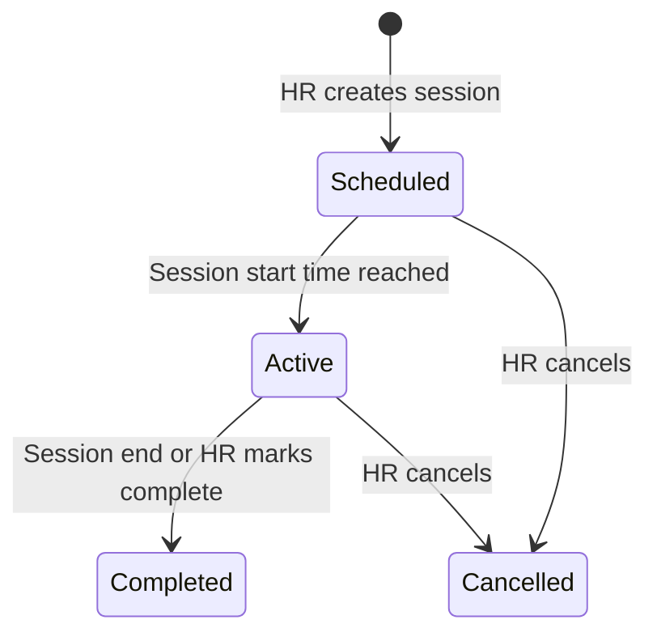

# Training Module

## Overview

Training management is **separate from office attendance**. HR creates trainings, schedules sessions, assigns participants, and tracks attendance via face, QR, or geo.

## Entities

| Entity | Description |
|--------|-------------|
| `trainings` | Training program (title, trainer, materials) |
| `training_sessions` | Scheduled instance with time, location, QR |
| `training_participants` | Employees assigned to a training |
| `training_attendance` | Per-session check-in record |

## HR Workflow

1. Create training (`POST /trainings`)
2. Create session with schedule (`POST /trainings/{id}/sessions`)
3. Assign participants (`POST /sessions/{id}/participants`)
4. At session time: display QR or monitor attendance
5. After session: trigger feedback forms

## Attendance Methods

### 1. Face Recognition

Same pipeline as office check-in but against enrolled face profile.

```json
POST /trainings/sessions/{id}/attend
{
  "method": "face",
  "face_image": "base64..."
}
```

### 2. QR Code Scan

HR displays QR on `TrainingSessionScreen`. Employee scans.

- QR contains signed JWT token with `session_id`, `expires_at`
- Default expiry: 15 minutes (regenerated on request)
- One scan per employee per session

```json
{
  "method": "qr",
  "qr_token": "eyJ..."
}
```

### 3. Geo Validation

Session must have `location_lat/lng` set.

```json
{
  "method": "geo",
  "latitude": 28.6139,
  "longitude": 77.2090
}
```

Validates within 300m of session location.

## Session Lifecycle



## Metrics

Computed per training and per session:

| Metric | Formula |
|--------|---------|
| Attendance % | `attended / assigned × 100` |
| Completion % | `completed_sessions / total_sessions × 100` |
| Session duration | `actual_end - actual_start` |
| Participation rate | `unique_attendees / total_employees × 100` |

## API Summary

| Method | Endpoint | Role |
|--------|----------|------|
| GET | `/trainings` | All |
| POST | `/trainings` | HR Manager |
| POST | `/trainings/{id}/sessions` | HR Manager |
| POST | `/sessions/{id}/participants` | HR Manager |
| POST | `/sessions/{id}/attend` | Employee |
| GET | `/sessions/{id}/qr` | HR Manager |
| GET | `/trainings/dashboard` | HR+ |

## Mobile Screens

| Screen | Role |
|--------|------|
| `TrainingListScreen` | Employee — assigned trainings |
| `TrainingDetailScreen` | Employee — session info, join |
| `QRScanScreen` | Employee — scan to attend |
| `TrainingManageScreen` | HR — create/edit |
| `TrainingSessionScreen` | HR — QR display, live attendance |
| `TrainingDashboardScreen` | HR — metrics |

## Materials

- `materials_url` — link to S3/document
- Open in-app browser or download via share sheet

## Notifications

- Training reminder: 1 hour before session start
- Feedback prompt: 30 minutes after session marked complete
